# Html5-QRCode 
## (supports barcodes now :))
A cross-platform HTML5 QR code & barcode reader.

Use this lightweight library to easily / quickly integrate QR code, bar code, and other common code scanning capabilities to your web application. 
-   Supports easy scanning using an integrated webcam or camera in smartphones (Android / IOS).

-   Supports scanning codes from files or default cameras on smartphones.

-   **<u>Recently Added</u>** Supports bar code scanning in various formats.

-   Supports two kinds of APIs
    -   `Html5QrcodeScanner` — End-to-end scanner with UI, integrate with less than ten lines of code.
    -   `Html5Qrcode` — Powerful set of APIs you can use to build your UI without worrying about camera setup, handling permissions, reading codes, etc.

> Support for scanning local files on the device is a new addition and helpful for the web browser which does not support inline web-camera access in smartphones. **Note:** This doesn't upload files to any server — everything is done locally.

[](https://travis-ci.org/mebjas/html5-qrcode) [](https://github.com/mebjas/html5-qrcode/issues) [](https://github.com/mebjas/html5-qrcode/releases)  [](https://www.codacy.com/gh/mebjas/html5-qrcode/dashboard?utm_source=github.com&amp;utm_medium=referral&amp;utm_content=mebjas/html5-qrcode&amp;utm_campaign=Badge_Grade) [](https://gitter.im/html5-qrcode/community?utm_source=badge&utm_medium=badge&utm_campaign=pr-badge)

 [](https://www.npmjs.com/package/html5-qrcode)


| 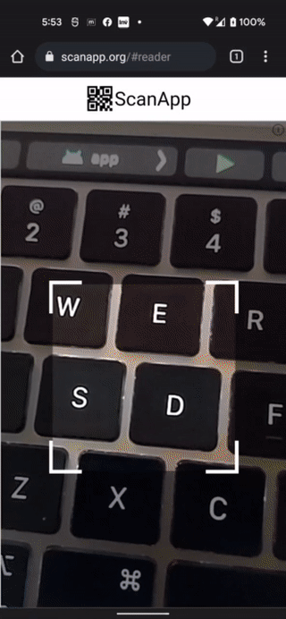 | 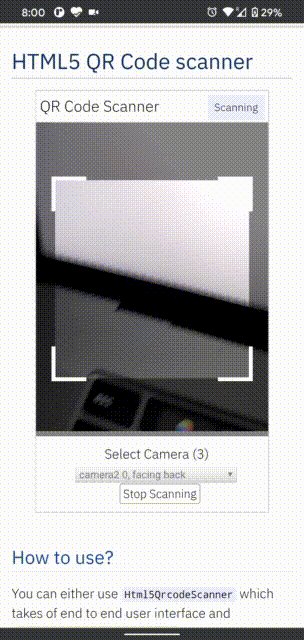|
| -- | -- |
| _Demo at [scanapp.org](https://scanapp.org)_ | _Demo at [qrcode.minhazav.dev](https://qrcode.minhazav.dev) - **Scanning different types of codes**_ |

## Notice
**UX/UXD/UXR help wanted**: We are looking to improve user experience of this code scanning library — if you are interested in making this experience better for both developers and end users, please share your ideas, thoughts, inputs in [this discussion](https://github.com/mebjas/html5-qrcode/discussions/213)

## Supported platforms
We are working continuously on adding support for more and more platforms. If you find a platform or a browser where the library is not working, please feel free to file an issue. Check the [demo link](https://blog.minhazav.dev/research/html5-qrcode.html) to test it out.

**Legends**
-    Means full support — inline webcam and file based 
-    Means partial support — only file based, webcam in progress

### PC / Mac

| <br/>Firefox | <br/>Chrome | <br/>Safari | <br/>Opera | <br/> Edge
| --------- | --------- | --------- | --------- | ------- |
|| | |  | 

### Android

| <br/>Chrome | <br/>Firefox | <br/> Edge | <br/>Opera | <br/> Opera Mini |  <br/> UC
| --------- | --------- | --------- | --------- |  --------- | --------- |
|| | | |  |  

### IOS

| <br/>Safari | <br/>Chrome | <br/>Firefox | <br/> Edge 
| --------- | --------- | --------- | --------- |
|| | |  

> Apparently, Webkit for IOS is used by Chrome, Firefox, and other browsers in IOS and they do not have webcam permissions yet. There is an ongoing issue on fixing the support for iOS - [issue/14](https://github.com/mebjas/html5-qrcode/issues/14)

### Framework support
The library can be easily used with several other frameworks, I have been adding examples for a few of them and would continue to add more.

|| | | 
| -------- | -------- | -------- | -------- |
| [Html5](./examples/html5) | [VueJs](./examples/vuejs) | [ElectronJs](./examples/electron) | [React](./examples/react)

### Supported Code formats
Code scanning is dependent on [Zxing-js](https://github.com/zxing-js/library) library. We will be working on top of it to add support for more types of code scanning. If you feel a certain type of code would be helpful to have, please file a feature request.

| Code | Example |
| ---- | ----- |
| QR Code | 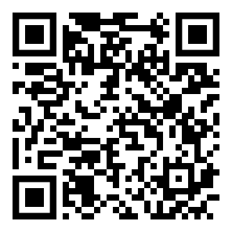 |
| AZTEC | 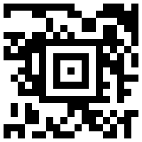 |
| CODE_39|  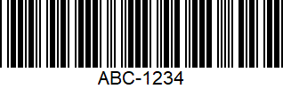 |
| CODE_93| 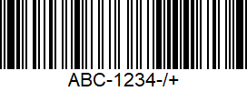|
| CODE_128| 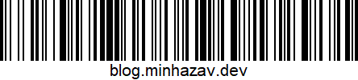|
| ITF| 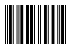|
| EAN_13|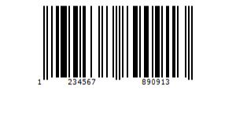 |
| EAN_8| 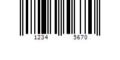|
| PDF_417| 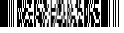|
| UPC_A| 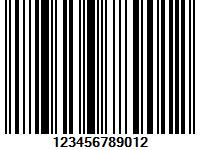|
| UPC_E| 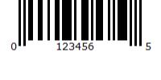|
| DATA_MATRIX|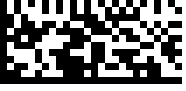 |
| MAXICODE*| 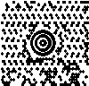 |
| RSS_14*| 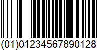|
| RSS_EXPANDED*|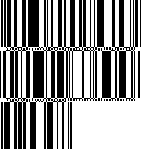 |

> *Formats are not supported by our experimental integration with native
> BarcodeDetector API integration ([Read more](/experimental.md)).

## Description - [View Demo](https://blog.minhazav.dev/research/html5-qrcode.html)

> See an end to end scanner experience at [scanapp.org](https://scanapp.org).

This is a cross-platform JavaScript library to integrate QR code, bar codes & a few other types of code scanning capabilities to your applications running on HTML5 compatible browser.

Supports:
-   Querying camera on the device (with user permissions)
-   Rendering live camera feed, with easy to use user interface for scanning
-   Supports scanning a different kind of QR codes, bar codes and other formats
-   Supports selecting image files from the device for scanning codes

## How to use
> For full information [read this article](https://blog.minhazav.dev/HTML5-QR-Code-scanning-launched-v1.0.1/).

Download the script from [release page](https://github.com/mebjas/html5-qrcode/releases) or install using `npm` with:
```sh
npm i html5-qrcode
```

Add an element you want to use as a placeholder for QR Code scanner
```html
<div id="reader" width="600px"></div>
```
> Ideally do not set the height of this container as the height should depend on the height of the video feed from the camera. The library would honor the existing width, otherwise apply the default width. The height is derived from the aspect ratio of the video feed.

### Using directly in browser without any loader
If you are not using any loader, you can get the latest UMD javascript code in production from [https://unpkg.com/html5-qrcode](https://unpkg.com/html5-qrcode).

```html
<script src="https://unpkg.com/html5-qrcode" type="text/javascript">
```

> In case you installed the plugin using `npm` but still use javascript without any module loader, you can get the minified script in `node_modules/html5-qrcode/html5-qrcode.min.js`

### Using with module loaders
Include the script with

```js
// To use Html5QrcodeScanner (more info below)
import {Html5QrcodeScanner} from "html5-qrcode"

// To use Html5Qrcode (more info below)
import {Html5Qrcode} from "html5-qrcode"
```

### Easy Mode - With end to end scanner user interface
`Html5QrcodeScanner` lets you implement an end to end scanner with few lines of code with the default user interface which allows scanning using the camera or selecting an image from the file system.

You can set up the scanner as follows:
```js
function onScanSuccess(decodedText, decodedResult) {
  // handle the scanned code as you like, for example:
  console.log(`Code matched = ${decodedText}`, decodedResult);
}

function onScanFailure(error) {
  // handle scan failure, usually better to ignore and keep scanning.
  // for example:
  console.warn(`Code scan error = ${error}`);
}

let html5QrcodeScanner = new Html5QrcodeScanner(
  "reader",
  { fps: 10, qrbox: {width: 250, height: 250} },
  /* verbose= */ false);
html5QrcodeScanner.render(onScanSuccess, onScanFailure);
```

### Pro Mode - if you want to implement your own user interface
You can use `Html5Qrcode` class to set up your QR code scanner (with your own user interface) and allow users to scan QR codes using the camera or by choosing an image file in the file system or native cameras in smartphones.

You can use the following APIs to `fetch camera`, `start` scanning and `stop` scanning.

#### For using inline QR Code scanning with Webcam or Smartphone camera

##### Start Scanning
To get a list of supported cameras, query it using static method `Html5Qrcode.getCameras()`. This method returns a `Promise` with a list of devices supported in format `{ id: "id", label: "label" }`. 
```js
// This method will trigger user permissions
Html5Qrcode.getCameras().then(devices => {
  /**
   * devices would be an array of objects of type:
   * { id: "id", label: "label" }
   */
  if (devices && devices.length) {
    var cameraId = devices[0].id;
    // .. use this to start scanning.
  }
}).catch(err => {
  // handle err
});
```

**Important**: Note that this method will trigger user permission if the user has not granted it already. 
> Warning: Direct access to the camera is a powerful feature. It requires consent from the user, and your site MUST be on a secure origin (HTTPS).
> 
> Warning: Asking for access to the camera on page load will result in most of your users rejecting access to it. [More info](https://developers.google.com/web/fundamentals/media/capturing-images)

Once you have the camera ID from `device.id`, start camera using `Html5Qrcode#start(..)`. This method returns a `Promise` with Qr code scanning initiation.
```js
const html5QrCode = new Html5Qrcode(/* element id */ "reader");
html5QrCode.start(
  cameraId, 
  {
    fps: 10,    // Optional, frame per seconds for qr code scanning
    qrbox: { width: 250, height: 250 }  // Optional, if you want bounded box UI
  },
  (decodedText, decodedResult) => {
    // do something when code is read
  },
  (errorMessage) => {
    // parse error, ignore it.
  })
.catch((err) => {
  // Start failed, handle it.
});
```

> You can optionally set another argument in constructor called `verbose` to print all logs to console

```js
const html5QrCode = new Html5Qrcode("reader", /* verbose= */ true);
```

##### Scanning without cameraId
In mobile devices you may want users to directly scan the QR code using the back camera or the front camera for some use cases. For such cases you can avoid using the exact camera device ID that you get from `Html5Qrcode.getCameras()`. The `start()` method allows passing constraints in place of camera device ID similar to [html5 web API syntax](https://developer.mozilla.org/en-US/docs/Web/API/MediaDevices/getUserMedia#Syntax). You can start scanning like mentioned in these examples:

```js
const html5QrCode = new Html5Qrcode("reader");
const qrCodeSuccessCallback = (decodedText, decodedResult) => {
    /* handle success */
};
const config = { fps: 10, qrbox: { width: 250, height: 250 } };

// If you want to prefer front camera
html5QrCode.start({ facingMode: "user" }, config, qrCodeSuccessCallback);

// If you want to prefer back camera
html5QrCode.start({ facingMode: "environment" }, config, qrCodeSuccessCallback);

// Select front camera or fail with `OverconstrainedError`.
html5QrCode.start({ facingMode: { exact: "user"} }, config, qrCodeSuccessCallback);

// Select back camera or fail with `OverconstrainedError`.
html5QrCode.start({ facingMode: { exact: "environment"} }, config, qrCodeSuccessCallback);
```

Passing the `cameraId` (recommended approach) is similar to
```js
html5QrCode.start({ deviceId: { exact: cameraId} }, config, qrCodeSuccessCallback);
```

##### Stop Scanning

To stop using camera and thus stop scanning, call `Html5Qrcode#stop()` which returns a `Promise` for stopping the video feed and scanning.
```js
html5QrCode.stop().then((ignore) => {
  // QR Code scanning is stopped.
}).catch((err) => {
  // Stop failed, handle it.
});
```

> Note that the class is stateful and `stop()` should be called to properly tear down the video and camera objects safely after calling `start()` when the scan is over or the user intend to move on. `stop()` will stop the video feed on the viewfinder.

#### For QR Code scanning using local files or inbuilt camera on Smartphones
| Selector in Android | Selector in IOS|
|------|-------|
| Taken on Pixel 3, Google Chrome<br>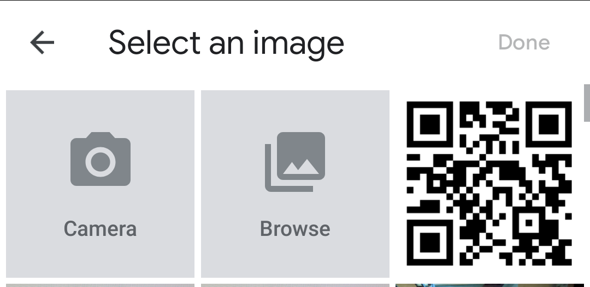 |  Taken on iPhone 7, Google Chrome<br>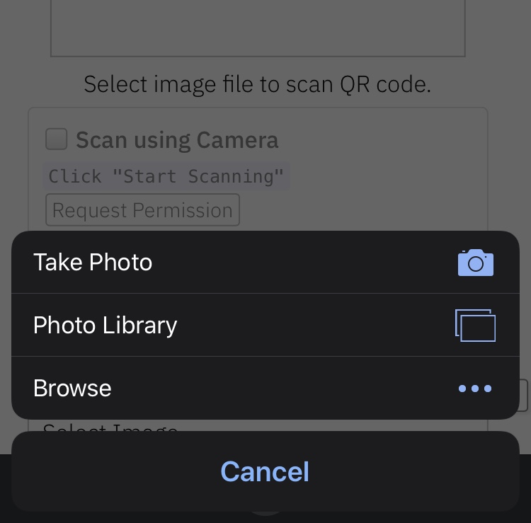 |

You can alternatively leverage QR Code scanning for local files on the device or default camera on the device. It works similar to inline QR Code scanning.

Define the HTML container and import the JavaScript library as mentioned above
```html
<div id="reader" width="600px" height="600px"></div>
<script src="./dist/html5-qrcode.js"></script>
```
> It's not mandatory to set the height and width of the HTML element. If provided, the library would try to honor it. If it's not set, the library would set a default width and derive the height based on the input image's aspect ratio.

Add an `Input` element for supporting file selection like this:
```html
<input type="file" id="qr-input-file" accept="image/*">
<!-- 
  Or add captured if you only want to enable smartphone camera, PC browsers will ignore it.
-->

<input type="file" id="qr-input-file" accept="image/*" capture>
```
Find more information about this at [developers.google.com](https://developers.google.com/web/fundamentals/media/capturing-images).

And in JavaScript code initialize the object and attach listener like this:
```js
const html5QrCode = new Html5Qrcode(/* element id */ "reader");
// File based scanning
const fileinput = document.getElementById('qr-input-file');
fileinput.addEventListener('change', e => {
  if (e.target.files.length == 0) {
    // No file selected, ignore 
    return;
  }

  const imageFile = e.target.files[0];
  // Scan QR Code
  html5QrCode.scanFile(imageFile, true)
  .then(decodedText => {
    // success, use decodedText
    console.log(decodedText);
  })
  .catch(err => {
    // failure, handle it.
    console.log(`Error scanning file. Reason: ${err}`)
  });
});

// Note: Current public API `scanFile` only returns the decoded text. There is
// another work in progress API (in beta) which returns a full decoded result of
// type `QrcodeResult` (check interface in src/core.ts) which contains the
// decoded text, code format, code bounds, etc.
// Eventually, this beta API will be migrated to the public API.
```

> Note that inline scanning and file-based scanning are mutually exclusive at the moment. This means you can only use one of them at a time. I'll soon be adding support for the option to have both if the requirement comes in. If you want to use both, use `html5QrCode#clear()` method to clear the canvas.

## Demo
<br>
_Scan this image or visit [blog.minhazav.dev/research/html5-qrcode.html](https://blog.minhazav.dev/research/html5-qrcode.html)_

### For more information
Check these articles on how to use this library:
<!-- TODO(mebjas) Mirgate this link to blog.minhazav.dev -->
-   [QR and barcode scanner using HTML and JavaScript](https://minhazav.medium.com/qr-and-barcode-scanner-using-html-and-javascript-2cdc937f793d)
-   [HTML5 QR Code scanning — launched v1.0.1 without jQuery dependency and refactored Promise based APIs](https://blog.minhazav.dev/HTML5-QR-Code-scanning-launched-v1.0.1/).
-   [HTML5 QR Code scanning with JavaScript — Support for scanning the local file and using default camera added (v1.0.5)](https://blog.minhazav.dev/HTML5-QR-Code-scanning-support-for-local-file-and-default-camera/)

## Screenshots
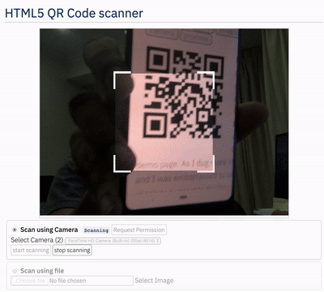<br>
_Figure: Screenshot from Google Chrome running on MacBook Pro_

## Documentation
Following methods are available in this library (typescript definition)

```ts
/** Camera Device interface. */
interface CameraDevice {
  id: string;
  label: string;
}

/** Different states of scanner */
enum Html5QrcodeScannerState {
  // Indicates the sanning is not running or user is using file based
  // scanning.
  NOT_STARTED = 0,
  // Camera scan is running.
  SCANNING,
  // Camera scan is paused but camera is running.
  PAUSED,
}

/**
 * Code formats supported by this library.
 */
enum Html5QrcodeSupportedFormats {
  QR_CODE = 0,
  AZTEC,
  CODABAR,
  CODE_39,
  CODE_93,
  CODE_128,
  DATA_MATRIX,
  MAXICODE,
  ITF,
  EAN_13,
  EAN_8,
  PDF_417,
  RSS_14,
  RSS_EXPANDED,
  UPC_A,
  UPC_E,
  UPC_EAN_EXTENSION,
}

/** Defines dimension for QR Code Scanner. */
interface QrDimensions {
  width: number;
  height: number;
}

/** Format of detected code. */
class QrcodeResultFormat {
  public readonly format: Html5QrcodeSupportedFormats;
  public readonly formatName: string;
}

/** Detailed scan result. */
interface QrcodeResult {
  /** Decoded text. */
  text: string;

  /** Format that was successfully scanned. */
  format?: QrcodeResultFormat,
}

/** QrCode result object. */
interface Html5QrcodeResult {
  decodedText: string;
  result: QrcodeResult;
}

/** Type for a callback for a successful code scan. */
type QrcodeSuccessCallback
  = (decodedText: string, result: Html5QrcodeResult) => void;

/** Type for a callback for failure during code scan. */
type QrcodeErrorCallback
  = (errorMessage: string, error: Html5QrcodeError) => void;

/**
 * Interface for configuring {@class Html5Qrcode} class instance.
 */
interface Html5QrcodeConfigs {
  /**
   * Array of formats to support of type {@type Html5QrcodeSupportedFormats}.
   */
  formatsToSupport: Array<Html5QrcodeSupportedFormats> | undefined;
}

/** Configuration for creating {@class Html5Qrcode}. */
interface Html5QrcodeFullConfig extends Html5QrcodeConfigs {
  /**
   * If true, all logs would be printed to console. False by default.
   */
  verbose: boolean | undefined;
}

interface Html5QrcodeCameraScanConfig {
  /**
   * Optional, Expected framerate of QR code scanning. example { fps: 2 } means the
   * scanning would be done every 500 ms.
   */
  fps: number | undefined;

  /**
   * Optional, edge size or dimension of QR scanning box, this should be 
   * smaller than the width and height of the full region.
   * This would make the scanner look like this:
   *          ----------------------
   *          |********************|
   *          |******,,,,,,,,,*****|      <--- shaded region
   *          |******|       |*****|      <--- non shaded region would be
   *          |******|       |*****|          used for QR code scanning.
   *          |******|_______|*****|
   *          |********************|
   *          |********************|
   *          ----------------------
   * 
   * Instance of {@interface QrDimensions} can be passed to construct a non
   * square rendering of scanner box.
   */
  qrbox?: number | QrDimensions | undefined;

  /**
   * Optional, Desired aspect ratio for the video feed. Ideal aspect ratios
   * are 4:3 or 16:9. Passing very wrong aspect ratio could lead to video feed
   * not showing up.
   */
  aspectRatio?: number | undefined;

  /**
   * Optional, if {@code true} flipped QR Code won't be scanned. Only use this
   * if you are sure the camera cannot give mirrored feed if you are facing
   * performance constraints.
   */
  disableFlip?: boolean | undefined;

  /*
   * Optional, @beta(this config is not well supported yet).
   *
   * Important: When passed this will override other parameters like
   * 'cameraIdOrConfig' or configurations like 'aspectRatio'.
   * 'videoConstraints' should be of type {@code MediaTrackConstraints} as
   * defined in
   * https://developer.mozilla.org/en-US/docs/Web/API/MediaTrackConstraints
   * and is used to specify a variety of video or camera controls like:
   * aspectRatio, facingMode, frameRate, etc.
   */
  videoConstraints?: MediaTrackConstraints | undefined;
}

/**
 * Interface for controlling different aspects of {@class Html5QrcodeScanner}.
 */
interface Html5QrcodeScannerConfig
  extends Html5QrcodeCameraScanConfig, Html5QrcodeConfigs {

  /**
   * If {@code true} the library will remember if the camera permissions
   * were previously granted and what camera was last used. If the permissions
   * is already granted for "camera", QR code scanning will automatically
   * start for previously used camera.
   */
  rememberLastUsedCamera?: boolean | undefined;
};

class Html5Qrcode {
  /**
   * Returns a Promise with a list of all cameras supported by the device.
   */
  static getCameras(): Array<CameraDevice> // Returns a Promise

  /**
   * Initialize QR Code scanner.
   * 
   * @param elementId - Id of the HTML element.
   * @param verbose - optional configuration object
   */
  constructor(elementId: string, config:  Html5QrcodeFullConfig | undefined) {}

  /**
   * Start scanning QR codes or barcodes for a given camera.
   * 
   * @param cameraIdOrConfig Identifier of the camera, it can either be the
   *  camera id retrieved from {@code Html5Qrcode#getCameras()} method or
   *  object with facing mode constraint.
   * @param configuration Extra configurations to tune the code scanner.
   * @param qrCodeSuccessCallback Callback called when an instance of a QR
   * code or any other supported bar code is found.
   * @param qrCodeErrorCallback Callback called in cases where no instance of
   * QR code or any other supported bar code is found.
   */
  start(
    cameraIdOrConfig: Html5QrcodeIdentifier,
    configuration: Html5QrcodeCameraScanConfig | undefined,
    qrCodeSuccessCallback: QrcodeSuccessCallback | undefined,
    qrCodeErrorCallback: QrcodeErrorCallback | undefined,
  ): Promise<null> {}

  /**
   * Pauses the ongoing scan.
   * 
   * Note: this will not stop the viewfinder, but stop decoding camera stream.
   * 
   * @throws error if method is called when scanner is not in scanning state.
   */
  pause();

  /**
   * Resumes the paused scan.
   * 
   * Note: with this caller will start getting results in success and error
   * callbacks.
   * 
   * @throws error if method is called when scanner is not in paused state.
   */
  resume();

  /**
   * Stops streaming QR Code video and scanning. 
   */
  stop(): Promise<void> {}

  /**
   * Gets state of the camera scan.
   *
   * @returns state of type {@enum ScannerState}.
   */
  getState(): Html5QrcodeScannerState;

  /**
   * Scans an Image File for QR Code.
   *
   * This feature is mutually exclusive to camera-based scanning, you should
   * call stop() if the camera-based scanning was ongoing.
   *
   * @param imageFile a local file with Image content.
   * @param showImage if true, the Image will be rendered on given element.
   *
   * @returns Promise with decoded QR code string on success.
   */
  scanFile(
    imageFile: File,
    /* default=true */ showImage: boolean | undefined): Promise<string> {}

  /**
   * Clears the existing canvas.
   * 
   * Note: in case of ongoing web-cam based scan, it needs to be explicitly
   * closed before calling this method, else it will throw an exception.
   */
  clear(): void {}  // Returns void
}

class Html5QrcodeScanner {
  /**
   * Creates an instance of this class.
   *
   * @param elementId Id of the HTML element.
   * @param config Extra configurations to tune the code scanner.
   * @param verbose - If true, all logs would be printed to console. 
   */
  constructor(
    elementId: string,
    config: Html5QrcodeScannerConfig | undefined,
    verbose: boolean | undefined) {}

  /**
   * Renders the User Interface.
   * 
   * @param qrCodeSuccessCallback Callback called when an instance of a QR
   * code or any other supported bar code is found.
   * @param qrCodeErrorCallback optional callback called in cases where no
   * instance of QR code or any other supported bar code is found.
   */
  render(
    qrCodeSuccessCallback: QrcodeSuccessCallback,
    qrCodeErrorCallback: QrcodeErrorCallback | undefined) {}

  /**
   * Pauses the ongoing scan.
   * 
   * Notes:
   * -   Should only be called if camera scan is ongoing.
   * -   This will not stop the viewfinder, but stop decoding camera stream.
   * 
   * @throws error if method is called when scanner is not in scanning state.
   */
  pause();

  /**
   * Resumes the paused scan.
   * 
   * Notes:
   * -   Should only be called if camera scan is ongoing.
   * -   With this caller will start getting results in success and error
   * callbacks.
   * 
   * @throws error if method is called when scanner is not in paused state.
   */
  resume();
    
  /**
   * Gets state of the camera scan.
   *
   * @returns state of type {@enum Html5QrcodeScannerState}.
   */
  getState(): Html5QrcodeScannerState;

  /** Removes the QR Code scanner. */
  clear(): Promise<void>  {}
}
```

### Extra optional `configuration` in `start()` method
Configuration object that can be used to configure both the scanning behavior and the user interface (UI). Most of the fields have default properties that will be used unless a different value is provided. If you do not want to override anything, you can just pass in an empty object `{}`.

#### `fps` — Integer, Example = 10
A.K.A frame per second, the default value for this is 2, but it can be increased to get faster scanning. Increasing too high value could affect performance. Value `>1000` will simply fail.

#### `qrbox` — `QrDimensions`, Example = `{ width: 250, height: 250 }`
Use this property to limit the region of the viewfinder you want to use for scanning. The rest of the viewfinder would be shaded. For example, by passing config `{ qrbox : { width: 250, height: 250 } }`, the screen will look like:


This can be used to set a rectangular scanning area with config like:

```js
let config = { qrbox : { width: 400, height: 150 } }
```

> This might be desirable for bar code scanning.

#### `aspectRatio` — Float, Example 1.777778 for 16:9 aspect ratio
Use this property to render the video feed in a certain aspect ratio. Passing a nonstandard aspect ratio like `100000:1` could lead to the video feed not even showing up. Ideal values can be:
| Value | Aspect Ratio | Use Case |
| ----- | ------------ | -------- |
|1.333334 | 4:3 | Standard camera aspect ratio |
|1.777778 | 16:9 | Full screen, cinematic |
|1.0 | 1:1 | Square view |

If you do not pass any value, the whole viewfinder would be used for scanning. 
**Note**: this value has to be smaller than the width and height of the `QR code HTML element`.

#### `disableFlip` — Boolean (Optional), default = false
By default, the scanner can scan for horizontally flipped QR Codes. This also enables scanning QR code using the front camera on mobile devices which are sometimes mirrored. This is `false` by default and I recommend changing this only if:
-   You are sure that the camera feed cannot be mirrored (Horizontally flipped)
-   You are facing performance issues with this enabled.

Here's an example of a normal and mirrored QR Code
| Normal QR Code | Mirrored QR Code |
| ----- | ---- |
|  | <br> |

#### `rememberLastUsedCamera` — Boolean (Optional), default = true
If `true` the last camera used by the user and weather or not permission was granted would be remembered in the local storage. If the user has previously granted permissions — the request permission option in the UI will be skipped and the last selected camera would be launched automatically for scanning.

If `true` the library shall remember if the camera permissions were previously
granted and what camera was last used. If the permissions is already granted for
"camera", QR code scanning will automatically * start for previously used camera.

### Scanning only specific formats
By default, both camera stream and image files are scanned against all the
supported code formats.  Both `Html5QrcodeScanner` and `Html5Qrcode` classes can
 be configured to only support a subset of supported formats. Supported formats
are defined in
[enum Html5QrcodeSupportedFormats](https://github.com/mebjas/html5-qrcode/blob/master/src/core.ts#L14).

```ts
enum Html5QrcodeSupportedFormats {
  QR_CODE = 0,
  AZTEC,
  CODABAR,
  CODE_39,
  CODE_93,
  CODE_128,
  DATA_MATRIX,
  MAXICODE,
  ITF,
  EAN_13,
  EAN_8,
  PDF_417,
  RSS_14,
  RSS_EXPANDED,
  UPC_A,
  UPC_E,
  UPC_EAN_EXTENSION,
}
```

I recommend using this only if you need to explicitly omit support for certain
formats or want to reduce the number of scans done per second for performance
reasons.

#### Scanning only QR code with `Html5Qrcode`
```js
const html5QrCode = new Html5Qrcode(
  "reader", { formatsToSupport: [ Html5QrcodeSupportedFormats.QR_CODE ] });
const qrCodeSuccessCallback = (decodedText, decodedResult) => {
    /* handle success */
};
const config = { fps: 10, qrbox: { width: 250, height: 250 } };

// If you want to prefer front camera
html5QrCode.start({ facingMode: "user" }, config, qrCodeSuccessCallback);
```

#### Scanning only QR code and UPC codes with `Html5QrcodeScanner`
```js
function onScanSuccess(decodedText, decodedResult) {
  // Handle the scanned code as you like, for example:
  console.log(`Code matched = ${decodedText}`, decodedResult);
}

const formatsToSupport = [
  Html5QrcodeSupportedFormats.QR_CODE,
  Html5QrcodeSupportedFormats.UPC_A,
  Html5QrcodeSupportedFormats.UPC_E,
  Html5QrcodeSupportedFormats.UPC_EAN_EXTENSION,
];
const html5QrcodeScanner = new Html5QrcodeScanner(
  "reader",
  {
    fps: 10,
    qrbox: { width: 250, height: 250 },
    formatsToSupport: formatsToSupport
  },
  /* verbose= */ false);
html5QrcodeScanner.render(onScanSuccess);
```

## Experimental features
The library now supports some experimental features which are supported in the
library but not recommended for production usage either due to limited testing
done or limited compatibility for underlying APIs used. Read more about it [here](/experimental.md).
Some experimental features include:
-   [Support for BarcodeDetector JavaScript API](/experimental.md)

## How to modify and build
1.  Code changes should only be made to [/src](./src) only.

2.  Run `npm install` to install all dependencies.

3.  Run `npm run-script build` to build JavaScript output. The output JavaScript distribution is built to [/dist/html5-qrcode.min.js](./dist/html5-qrcode.min.js). If you are developing on Windows OS, run `npm run-script build-windows`.

4.  Testing
    -   Run `npm test`
    -   Run the tests before sending a pull request, all tests should run.
    -   Please add tests for new behaviors sent in PR.

5.  Send a pull request
    -   Include code changes only to `./src`. **Do not change `./dist` manually.**
    -   In the pull request add a comment like
	  ```text
	  @all-contributors please add @mebjas for this new feature or tests
	  ```
	  -   For calling out your contributions, the bot will update the contributions file.
    -   Code will be built & published by the author in batches.

## Credits
The decoder used for the QR code reading is from `Zxing-js` https://github.com/zxing-js/library<br>
