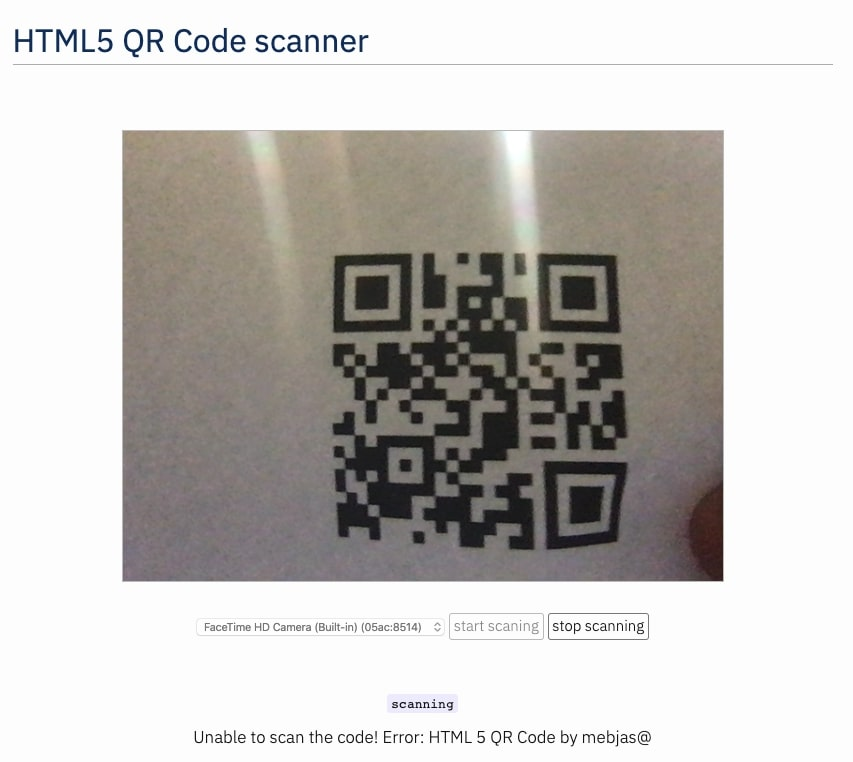

# HTML5-QRCode jQuery
A cross-platform HTML5 QR code reader as a jQuery plugin.

## Description - [View Demo](https://blog.minhazav.dev/research/html5-qrcode.html)

This is a cross-platform jQuery library to create a QRcode reader for HTML5 compatible browser.
It comes with the option to `scan QR Code`, `Stop scanning`, `Switch Camera` and `get info on camera`.

## How to use?
Add an element you want to use as placeholder for QR Code scanner
```html
<div id="reader"></div>
```

Add `jQuery library`, `jsqrcode-combined.js` and `html5-qrcode.js` (or their minified versions).
```html
<script src="./jquery.js"></script>
<script src="./jsqrcode-combined.js"></script>
<script src="./html5-qrcode.js"></script>
```

To get a list of supported cameras, query it using
```js
$(document).html5_qrcode_getSupportedCameras(
  function (devices) {
    /**
     * devices would be an array of objects of type:
     * { id: "id", label: "label" }
     */
    if (devices && devices.length) {
      var cameraId = devices[0].id;
      // .. use this to start scanning.
    }
  }, function (error) {
    // handle errors
  }
);
```

Once you have the camera id from `device.id`, start camera using
```js
$('#reader').html5_qrcode(
  cameraId,
  function (qrCodeMessage) {
    /* do something when code is read */
  }, function (errorMessage) {
    /* show read errors */
  }, function (errorMessage){
    /* the video stream could be opened */
  },
  { fps: 10 });
```

To stop using camera and thus stop scanning, call
```js
$('#reader').html5_qrcode_stop();
```
## Demo
[blog.minhazav.dev/research/html5-qrcode.html](https://blog.minhazav.dev/research/html5-qrcode.html)

### For more information
Check this article on how to use this library
[](https://blog.minhazav.dev/qr-code-scanner-using-html-and-javascript/)
[https://blog.minhazav.dev/qr-code-scanner-using-html-and-javascript/](https://blog.minhazav.dev/qr-code-scanner-using-html-and-javascript/)

## Screenshots

_Figure: Screenshot from Google Chrome running on Macbook Pro_

<br>
_Figure: Screenshot from Google Chrome running on Android-based Pixel 3_

## Documentation
Following methods are available in this library

```js
/**
 * Initializes QR code scanning on given element.
 *  
 * @param: cameraId (int) - which camera to use
 * @param: qrcodeSuccessCallback (function) - callback on success
 *              type: function (qrCodeMessage) {}
 * @param: qrcodeErrorCallback (function) - callback on QR parse error
 *              type: function (errorMessage) {}
 * @param: videoErrorCallback (function) - callback on video error
 *              type: function (errorMessage) {}
 * @param: config extra configurations to tune QR code scanner.
 *          Supported fields:
 *           - fps: expected framerate of qr code scanning. example { fps: 2 }
 *               means the scanning would be done every 500 ms.
 */
html5_qrcode: function(
  cameraId,
  qrcodeSuccessCallback,
  qrcodeErrorCallback,
  videoErrorCallback,
  config) {}

/**
 * Stops streaming QR Code video and scanning.
 */
html5_qrcode_stop: function() {}

/**
 * Gets the count of number of available cameras.
 * 
 * @param onSuccessCallback (Function) called when camera count is available.
 *              type: Function (Array [{ id: String, label: String }]) {}
 *              This argument is required.
 * @param onErrorCallback (function) called when enumerating cameras fails.
 *              type: Function (String)
 */
html5_qrcode_getSupportedCameras: function(
  onSuccessCallback, onErrorCallback) {}
        
```

## Credits
The decoder used for the QRcode reading is from `LazarSoft` https://github.com/LazarSoft/jsqrcode<br>
