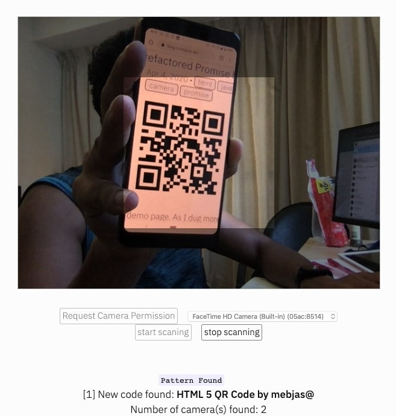

# Html5-QRCode
A cross-platform HTML5 QR code reader.
Use this light-weight Javascript library `(52 Kb)` to add QR Code scanning capability in your web application.

## Supported platforms
Working on adding support for more and more platforms. If you find a platform or browser where the library is not working please feel free to file an issue. Check the [demo link](https://blog.minhazav.dev/research/html5-qrcode.html) to test out.

##### Legends
 -  Means supported 
 -  Means work in progress to add support

### PC / Mac

| <br/>Firefox | <br/>Chrome | <br/>Safari | <br/>Opera | <br/> Edge
| --------- | --------- | --------- | --------- | ------- |
|| | |  | 

### Android

| <br/>Chrome | <br/>Firefox | <br/> Edge | <br/> Opera Mini
| --------- | --------- | --------- | --------- |
|| | |  

### IOS
> There is an ongoing issue on fixing the support for iOS - [issue/14](https://github.com/mebjas/html5-qrcode/issues/14)

| <br/>Safari | <br/>Chrome | <br/>Firefox | <br/> Edge | <br/> Opera Touch
| --------- | --------- | --------- | --------- | ------- |
|| | |  | 


## Description - [View Demo](https://blog.minhazav.dev/research/html5-qrcode.html)

This is a cross-platform javascript library to create a QRcode reader for HTML5 compatible browser.

Supports:
 - Querying all camera in the device (With user permissions)
 - Using any camera for scanning QR Code.

## How to use?
> For full information [read this article](https://blog.minhazav.dev/HTML5-QR-Code-scanning-launched-v1.0.1/).

Add an element you want to use as placeholder for QR Code scanner
```html
<div id="reader"></div>
```

Add `minified/html5-qrcode.min.js` in your web page. 
> I would recommend using the minified version as it's transformed to standard javascript. The `html5-qrcode.js` is written with ECMAScript and may not be supported in older version of the browsers. I wrote in this as it's easier to maintain!

```html
<script src="./minified/html5-qrcode.js"></script>
<!--
  Or use directly from Github

<script src="https://raw.githubusercontent.com/mebjas/html5-qrcode/master/minified/html5-qrcode.min.js"></script>
-->
```

To get a list of supported cameras, query it using static method `Html5Qrcode.getCameras()`. This method returns a `Promise` with list of devices supported in format `{ id: "id", label: "label" }`.
```js
// This method will trigger user permissions
Html5Qrcode.getCameras().then(cameras => {
  /**
   * devices would be an array of objects of type:
   * { id: "id", label: "label" }
   */
  if (devices && devices.length) {
    var cameraId = devices[0].id;
    // .. use this to start scanning.
  }
}).catch(err => {
  // handle err
});
```

Once you have the camera id from `device.id`, start camera using `Html5Qrcode#start(..)`. This method returns a `Promise` with Qr code scanning initiation.
```js
const html5QrCode = new Html5Qrcode(/* element id */ "reader");
html5QrCode.start(
  cameraId, 
  { fps: 10 },
  qrCodeMessage => {
    // do something when code is read
  },
  errorMessage => {
    // parse error, ignore it.
  })
.catch(err => {
  // Start failed, handle it.
});
```

To stop using camera and thus stop scanning, call `Html5Qrcode#stop()` which returns a `Promise` for stopping the video feed and scanning.
```js
html5QrCode.stop().then(ignore => {
  // QR Code scanning is stopped.
}).catch(err => {
  // Stop failed, handle it.
});
```
## Demo
[blog.minhazav.dev/research/html5-qrcode.html](https://blog.minhazav.dev/research/html5-qrcode.html)

### For more information
Check this article on how to use this library [HTML5 QR Code scanning - launched v1.0.1 without jQuery dependency and refactored Promise based APIs](https://blog.minhazav.dev/HTML5-QR-Code-scanning-launched-v1.0.1/).

## Screenshots
<br>
_Figure: Screenshot from Google Chrome running on Macbook Pro_

## Documentation
Following methods are available in this library

```js
class Html5Qrcode {
  /**
   * Returns a Promise with list of all cameras supported by the device.
   * 
   * The returned object is a list of result object of type:
   * [{
   *      id: String;     // Id of the camera.
   *      label: String;  // Human readable name of the camera.
   * }]
   */
  static getCameras() // Returns a Promise

  /**
   * Initialize QR Code scanner.
   * 
   * @param {String} elementId - Id of the HTML element. 
   */
  constructor(elementId) {}

  /**
   * Start scanning QR Code for given camera.
   * 
   * @param {String} cameraId Id of the camera to use.
   * @param {Object} config extra configurations to tune QR code scanner.
   *  Supported Fields:
   *      - fps: expected framerate of qr code scanning. example { fps: 2 }
   *          means the scanning would be done every 500 ms.
   * @param {Function} qrCodeSuccessCallback callback on QR Code found.
   *  Example:
   *      function(qrCodeMessage) {}
   * @param {Function} qrCodeErrorCallback callback on QR Code parse error.
   *  Example:
   *      function(errorMessage) {}
   * 
   * @returns Promise for starting the scan. The Promise can fail if the user
   * doesn't grant permission or some API is not supported by the browser.
   */
  start(cameraId,
      configuration,
      qrCodeSuccessCallback,
      qrCodeErrorCallback) {}  // Returns a Promise

  /**
   * Stops streaming QR Code video and scanning. 
   * 
   * @returns Promise for safely closing the video stream.
   */
  stop() {} // Returns a Promise
}       
```

## Credits
The decoder used for the QRcode reading is from `LazarSoft` https://github.com/LazarSoft/jsqrcode<br>
