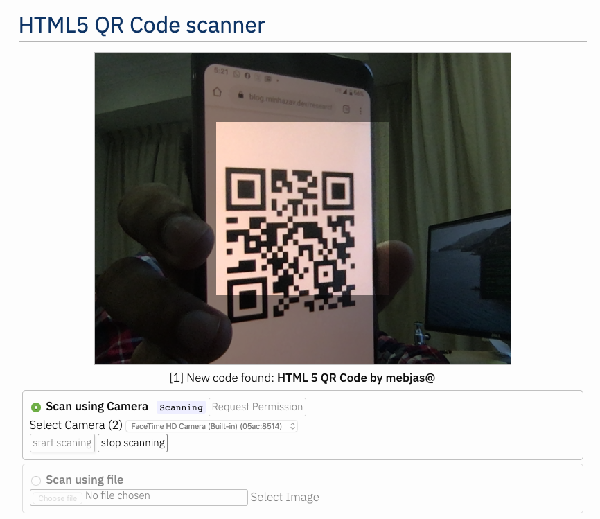

# Html5-QRCode
A cross-platform HTML5 QR code reader.
Use this light-weight Javascript library `(56 Kb)` to add QR Code scanning capability in your web application. 
 - Supports easy scanning using web-cam or camera in the smartphones (Android / IOS).
 - **Recently Added** Scanning QR Code from files or default camera on smartphones. 

> Support for scanning local files on the device is a new addition and helpful for the web browser which do not support inline web-camera access in smartphones. **Note:** This doesn't upload files to any server - everything is done locally.

[](https://github.com/mebjas/html5-qrcode/issues) [](https://github.com/mebjas/html5-qrcode/releases) 

[](https://www.npmjs.com/package/html5-qrcode)

## Supported platforms
Working on adding support for more and more platforms. If you find a platform or browser where the library is not working please feel free to file an issue. Check the [demo link](https://blog.minhazav.dev/research/html5-qrcode.html) to test out.

##### Legends
 -  Means full support - inline webcam and file based 
 -  Means partial support - only file based, webcam in progress

### PC / Mac

| <br/>Firefox | <br/>Chrome | <br/>Safari | <br/>Opera | <br/> Edge
| --------- | --------- | --------- | --------- | ------- |
|| | |  | 

### Android

| <br/>Chrome | <br/>Firefox | <br/> Edge | <br/>Opera | <br/> Opera Mini |  <br/> UC
| --------- | --------- | --------- | --------- |  --------- | --------- |
|| | | |  |  
 
### IOS

| <br/>Safari | <br/>Chrome | <br/>Firefox | <br/> Edge 
| --------- | --------- | --------- | --------- |
|| | |  

> Apparently, Webkit for IOS is used by Chrome, Firefox, and other browsers in IOS and they do not have webcam permissions yet. There is an ongoing issue on fixing the support for iOS - [issue/14](https://github.com/mebjas/html5-qrcode/issues/14)


## Description - [View Demo](https://blog.minhazav.dev/research/html5-qrcode.html)

This is a cross-platform javascript library to create a QRcode reader for HTML5 compatible browser.

Supports:
 - Querying all camera in the device (With user permissions)
 - Using any camera for scanning the QR Code.

## How to use?
> For full information [read this article](https://blog.minhazav.dev/HTML5-QR-Code-scanning-launched-v1.0.1/).

Download the script from [release page](https://github.com/mebjas/html5-qrcode/releases) or `npm` with:
```
npm i html5-qrcode
```

Add an element you want to use as placeholder for QR Code scanner
```html
<div id="reader"></div>
```

Add `minified/html5-qrcode.min.js` in your web page. 
> I would recommend using the minified version as it's transformed to standard javascript. The `html5-qrcode.js` is written with ECMAScript and may not be supported in the older version of the browsers. I wrote in this as it's easier to maintain!

```html
<script src="./minified/html5-qrcode.js"></script>
<!--
  Or use directly from Github

<script src="https://raw.githubusercontent.com/mebjas/html5-qrcode/master/minified/html5-qrcode.min.js"></script>
-->
```

### For using inline QR Code scanning with Webcam or Smartphone camera

To get a list of supported cameras, query it using static method `Html5Qrcode.getCameras()`. This method returns a `Promise` with list of devices supported in format `{ id: "id", label: "label" }`. 
```js
// This method will trigger user permissions
Html5Qrcode.getCameras().then(cameras => {
  /**
   * devices would be an array of objects of type:
   * { id: "id", label: "label" }
   */
  if (devices && devices.length) {
    var cameraId = devices[0].id;
    // .. use this to start scanning.
  }
}).catch(err => {
  // handle err
});
```

**Important**: Not that this method will trigger user permission if user has not granted already. 
> Warning: Direct access to the camera is a powerful feature. It requires consent from the user, and your site MUST be on a secure origin (HTTPS).
> 
> Warning: Asking for access to the camera on page load will result in most of your users rejecting access to it. [More info](https://developers.google.com/web/fundamentals/media/capturing-images)

Once you have the camera id from `device.id`, start camera using `Html5Qrcode#start(..)`. This method returns a `Promise` with Qr code scanning initiation.
```js
const html5QrCode = new Html5Qrcode(/* element id */ "reader");
html5QrCode.start(
  cameraId, 
  {
    fps: 10,    // Optional frame per seconds for qr code scanning
    qrbox: 250  // Optional if you want bounded box UI
  },
  qrCodeMessage => {
    // do something when code is read
  },
  errorMessage => {
    // parse error, ignore it.
  })
.catch(err => {
  // Start failed, handle it.
});
```

To stop using camera and thus stop scanning, call `Html5Qrcode#stop()` which returns a `Promise` for stopping the video feed and scanning.
```js
html5QrCode.stop().then(ignore => {
  // QR Code scanning is stopped.
}).catch(err => {
  // Stop failed, handle it.
});
```

> Note that the class is stateful and `stop()` should be called to properly tear down the video and camera objects safely after calling `start()` when the scan is over or user intend to move on. `stop()` will stop the video feed on the viewfinder.

### For QR Code scanning using local files or inbuild camera on Smartphones
| Selector in Android | Selector in IOS|
|------|-------|
| Taken on Pixel 3, Google Chrome<br> |  Taken on iPhone 7, Google Chrome<br> |

You can alternatively leverage QR Code scanning for local files on the device or default camera on the device. It works similar to inline QR Code scanning.

Define the HTML container and import the javascript library as mentioned above
```html
<div id="reader"></div>
<script src="./minified/html5-qrcode.js"></script>
```

Add an `Input` element for supporting file selection like this:
```html
<input type="file" id="qr-input-file" accept="image/*">
<!-- 
  Or add captured if you only want to enable smartphone camera, PC browsers will ignore it.
-->

<input type="file" id="qr-input-file" accept="image/*" capture>
```
Find more information about this at [developers.google.com](https://developers.google.com/web/fundamentals/media/capturing-images).

And in javascript code initialize the object and attach listener like this:
```js
const html5QrCode = new Html5Qrcode(/* element id */ "reader");
// File based scanning
const fileinput = document.getElementById('qr-input-file');
fileinput.addEventListener('change', e => {
  if (e.target.files.length == 0) {
    // No file selected, ignore 
    return;
  }

  const imageFile = e.target.files[0];
  // Scan QR Code
  html5QrCode.scanFile(imageFile, true)
  .then(qrCodeMessage => {
    // success, use qrCodeMessage
    console.log(qrCodeMessage);
  })
  .catch(err => {
    // failure, handle it.
    console.log(`Error scanning file. Reason: ${err}`)
  });
});
```

> Note that inline scanning and file-based scanning are mutually exclusive at the moment. This means, you can only use one of them at a time. I'll soon be adding support for the option to have both if the requirement comes in. If you want to use both, use `html5QrCode#clear()` method to clear the canvas.
## Demo
[blog.minhazav.dev/research/html5-qrcode.html](https://blog.minhazav.dev/research/html5-qrcode.html)

### For more information
Check this article on how to use this library, check following articles:
 - [HTML5 QR Code scanning - launched v1.0.1 without jQuery dependency and refactored Promise based APIs](https://blog.minhazav.dev/HTML5-QR-Code-scanning-launched-v1.0.1/).
 - [HTML5 QR Code scanning with javascript - Support for scanning the local file and using default camera added (v1.0.5)](https://blog.minhazav.dev/HTML5-QR-Code-scanning-support-for-local-file-and-default-camera/)

## Screenshots
<br>
_Figure: Screenshot from Google Chrome running on Macbook Pro_

## Documentation
Following methods are available in this library

```js
class Html5Qrcode {
  /**
   * Returns a Promise with list of all cameras supported by the device.
   * 
   * The returned object is a list of result object of type:
   * [{
   *      id: String;     // Id of the camera.
   *      label: String;  // Human readable name of the camera.
   * }]
   */
  static getCameras() // Returns a Promise

  /**
   * Initialize QR Code scanner.
   * 
   * @param {String} elementId - Id of the HTML element. 
   */
  constructor(elementId) {}

  /**
   * Start scanning QR Code for given camera.
   * 
   * @param {String} cameraId Id of the camera to use.
   * @param {Object} config extra configurations to tune QR code scanner.
   *  Supported Fields:
   *      - fps: expected framerate of qr code scanning. example { fps: 2 }
   *          means the scanning would be done every 500 ms.
   *      - qrbox: width of QR scanning box, this should be smaller than
   *          the width and height of the box. This would make the scanner
   *          look like this:
   *          ----------------------
   *          |********************|
   *          |******,,,,,,,,,*****|      <--- shaded region
   *          |******|       |*****|      <--- non shaded region would be
   *          |******|       |*****|          used for QR code scanning.
   *          |******|_______|*****|
   *          |********************|
   *          |********************|
   *          ----------------------
   * @param {Function} qrCodeSuccessCallback callback on QR Code found.
   *  Example:
   *      function(qrCodeMessage) {}
   * @param {Function} qrCodeErrorCallback callback on QR Code parse error.
   *  Example:
   *      function(errorMessage) {}
   * 
   * @returns Promise for starting the scan. The Promise can fail if the user
   * doesn't grant permission or some API is not supported by the browser.
   */
  start(cameraId,
      configuration,
      qrCodeSuccessCallback,
      qrCodeErrorCallback) {}  // Returns a Promise

  /**
   * Stops streaming QR Code video and scanning. 
   * 
   * @returns Promise for safely closing the video stream.
   */
  stop() {} // Returns a Promise

  /**
   * Scans an Image File for QR Code.
   * 
   * This feature is mutually exclusive to camera based scanning, you should call
   * stop() if the camera based scanning was ongoing.
   * 
   * @param {File} imageFile a local file with Image content.
   * @param {boolean} showImage if true the Image will be rendered on given element.
   * 
   * @returns Promise with decoded QR code string on success and error message on failure.
   *            Failure could happen due to different reasons:
   *            1. QR Code decode failed because enough patterns not found in image.
   *            2. Input file was not image or unable to load the image or other image load
   *              errors.
   */
  scanFile(imageFile, /* default=true */ showImage) {}

  /**
   * Clears the existing canvas.
   * 
   * Note: in case of ongoing web cam based scan, it needs to be explicitly
   * closed before calling this method, else it will throw exception.
   */
  clear() {}  // Returns void
}       
```

### Extra optional `configuration` in `start()` method
This is a configuration for the QR code scanning which can effect both scanning behavior and UI. There are two optional properties right now, if you don't want them you can just pass an empty object `{}`.

#### `fps` - Integer, Example = 10
A.K.A frame per second, the default value for this is 2 but it can be increased to get faster scanning. Increasing too high value could affect performance. Value `>1000` will simply fail.

#### `qrbox` - Integer, Example = 250
Use this property to limit the region of the viewfinder you want to use for scanning. The rest of the viewfinder would be shaded. For example by passing config `{ qrbox : 250 }`, the screen will look like:


If you do not pass any value, the whole viewfinder would be used for scanning. 
**Note**: this value has to be smaller than the width and height of the `QR code HTML element`.

## Credits
The decoder used for the QRcode reading is from `LazarSoft` https://github.com/LazarSoft/jsqrcode<br>
