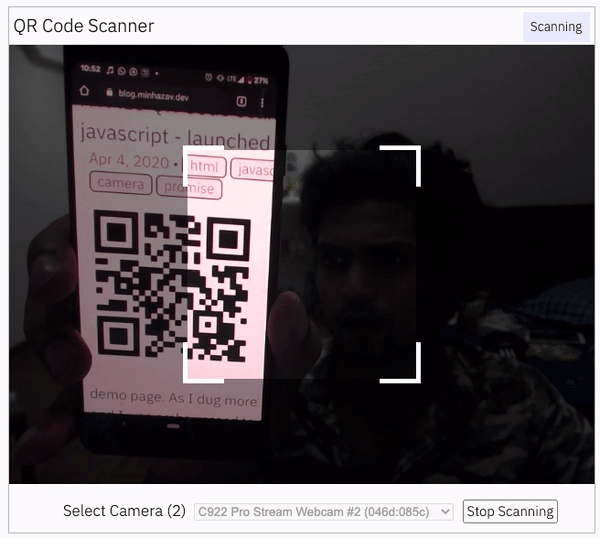

### Version 2.3.8
 -   `Scanner Paused` color tone changes.
 -   Misc code refactor.
 -   Backwards compatibility improvement by [bilal-elchami@](https://github.com/bilal-elchami) in [PR#700](https://github.com/mebjas/html5-qrcode/pull/700).
 -   Documentation generated and moved to [scanapp.org/html5-qrcode-docs](https://scanapp.org/html5-qrcode-docs/)
 -   `Html5QrcodeScannerConfig` exported, thanks to [PR#728](https://github.com/mebjas/html5-qrcode/pull/728) by [seyfer@](https://github.com/seyfer).
 -   `LitExample` added, thanks to [PR#704](https://github.com/mebjas/html5-qrcode/pull/704) by [kusigit@](https://github.com/kusigit).

**Sponsors**
Huge thanks to supporters of the mission who sponsored the project (See [Leaderboard](https://ko-fi.com/minhazav/leaderboard)).

-   Jari
-   Dave from Gravity Wiz


See the [sponsorship page](https://ko-fi.com/minhazav) at ko-fi.


### Version 2.3.7
-   Fix QR code scanning error.

### Version 2.3.6
-   Fix to minified js, some UI fixes to improve accessibility & SEO.

### Version 2.3.5

Multiple bug fixes
-   Missing `resolve()` in `Html5QrcodeScanner` fixed in [PR#168](https://github.com/mebjas/html5-qrcode/pull/684) by [itsUndefined](https://github.com/itsUndefined).
-   Fixed uncaught type error issue in [PR#671](https://github.com/mebjas/html5-qrcode/pull/671) by [zolfariot](https://github.com/zolfariot).
-   Add sync issue in `RenderedCameraImpl` in [PR#648](https://github.com/mebjas/html5-qrcode/pull/648) by [pholawat-tle](https://github.com/pholawat-tle).


### Version 2.3.4
-    `useBarCodeDetectorIfSupported` defaults to `true` and if supported the library will internally alternate between `BarcodeDetector` and `zxing-js`. Same robustness added for file based scan as well if more than one decoder is supported.
-    Fixed the UI issue - [Issue#613](https://github.com/mebjas/html5-qrcode/issues/613).
-    Fix for torch issue - [Issue#634](https://github.com/mebjas/html5-qrcode/issues/634).
-    In case of `scanFile(..)` APIs, scan at image resolution. Show `Loading image...` while the image is being loaded for rendering. More info at [Issue#612](https://github.com/mebjas/html5-qrcode/issues/612)

### Version 2.3.3
Quick fix for - [issue#621](https://github.com/mebjas/html5-qrcode/issues/621). With this zoom & torch is not supported in firefox for now.

### Version 2.3.2

#### Features or bug fixes.
-   Hide margin of parent container when camera selection UI is hidden (if only 1 camera is found.) - [Issue#599](https://github.com/mebjas/html5-qrcode/issues/599), [PR#607](https://github.com/mebjas/html5-qrcode/pull/607) by [adamwolf@](https://github.com/adamwolf).

**Support for zoom slider in `Html5QrcodeScanner`.**
Added basic support for zoom feature under configuration flag (not enabled by default). This was raised in issue [issue#330](https://github.com/mebjas/html5-qrcode/issues/330).This should help address some focus issues raised so far.

Not supported on Safari or any IOS browser though!

How to use

```js
let html5QrcodeScanner = new Html5QrcodeScanner(
    "reader", 
    { 
        fps: 10,
        qrbox: qrboxFunction,
        useBarCodeDetectorIfSupported: true,
        rememberLastUsedCamera: true,
        aspectRatio: 4/3,
        showTorchButtonIfSupported: true,
        showZoomSliderIfSupported: true,
        defaultZoomValueIfSupported: 2
        // ^ this means by default camera will load at 2x zoom.
    });
```

#### Tech debts
-    Refactored the camera components out of `src/html5-qrcode.ts`

### Version 2.3.1
-   Improved support for UPC types - by [Breno1288](https://github.com/Breno1288), forked from PR - [pull#501](https://github.com/mebjas/html5-qrcode/pull/501)
-   Fix form submission in Firefox issue - [Discussion#413](https://github.com/mebjas/html5-qrcode/discussions/413#discussioncomment-2124480) by [Joggel72](https://github.com/Joggel72), forked from PR - [pull#431](https://github.com/mebjas/html5-qrcode/pull/431)
-   Fix support for UPC-E as called out in several bugs - [parent issue#605](https://github.com/mebjas/html5-qrcode/issues/605)
-   Add `willReadFrequently` attribute to canvas context for camera scan as per Google Chrome recommendation.

### Version 2.3.0

-    Added support for drag and drop of image in file based scanner.
-    Info UI updated.

### Version 2.2.8

#### Custom camera labels when not available.
In certain browsers as well as cases like Android Webview it looks like camera
name is not returned by the browser. In such cases the camera selection has
empty named options.

To make the UX better, the library will give custom names to the cameras.

-   Github Issue: [Issue#578](https://github.com/mebjas/html5-qrcode/issues/578)

For example in Duck Duck Go browser which has this behavior, it will look like
this

| Before selection | After selection |
| --- | --- |
|  |  |


### Version 2.2.7

#### Add support for custom CSS
Developer / User Story: As a developer I can write custom CSS for `Html5QrcodeScanner`.

Feature request: [Issue#389](https://github.com/mebjas/html5-qrcode/issues/389)

List of CSS class and IDs added.

1. All key elements will have a common CSS class `html5-qrcode-element`. This way developers can customise element by element. For example:

```css
button.html5-qrcode-element {
    color: 'red';
    border: '1px solid red';
}
```

Key elements are:
-    Request camera permission button.
-    "Scan and image file" vs "Scan using camera directly" link.
-    "File selection" input ('file')
-    Start or Stop camera button.
-    Camera selection Select element
-    Torch button

2. key elements will have specific IDs defined in `src/ui/scanner/base.ts`. This can be used to customise per elements.


##### TODOs
-   [ ] Document in a blog post
-   [ ] Add pointer in qrcode.minhazav.dev
-   [ ] Add pointer in Readme

#### Change file selection UI from `input` to `button`
Modified the UI a little to hide the file selection as input and replace with
custom button and javascript based solution.

One motivation here is this will allow more uniform style for the widget.

#### Graduate `useBarCodeDetectorIfSupported` to `Html5QrcodeConfigs`.
`useBarCodeDetectorIfSupported` was tested as an experimental configuration for
a long time and has proven to be very efficient and well supported. It has been
tested in [ScanApp](https://scanapp.org) for quiet some time.

Considering this experimental API is not well documented, it makes it hard for
folks to discover it. By graduating this configuration to `Html5QrcodeConfigs` I
hope to make it more discoverable.

In this version the `ExperimentalFeaturesConfig#useBarCodeDetectorIfSupported`
has been marked deprecated but not removed due to backwards compatibility
reasons. Users can set either of them but `Html5QrcodeConfigs` one will take
precedence if set.

Once further support is added to browsers, this can be set as true by default.

### Version 2.2.5 & Version 2.2.6

> Small minification fix in Version 2.2.6.

#### Added support for turning `torch` On and Off in `Html5QrcodeScanner`.
On supported devices + browsers.

This new feature will implement the feature request - [Issue#129](https://github.com/mebjas/html5-qrcode/issues/129) and add support for torch (also called flash) on supported devices and browsers.

So far I have confirmed functionality on Samsung Flip 4 Chrome and Internet (Samsung's default browser).

This is only supported on `Html5QrcodeScanner` and can be enabled using the config like this.

```ts
let html5QrcodeScanner = new Html5QrcodeScanner(
    "reader", 
    { 
        fps: 10,
        qrbox: qrboxFunction,
        // Important notice: this is experimental feature, use it at your
        // own risk. See documentation in
        // mebjas@/html5-qrcode/src/experimental-features.ts
        experimentalFeatures: {
            useBarCodeDetectorIfSupported: true
        },
        rememberLastUsedCamera: true,
        aspectRatio: 1.7777778,
        showTorchButtonIfSupported: true
    });
```

The `showTorchButtonIfSupported: true` part is the crucial one. It's off by default for now as I don't like the UI very much.

#### Added support for `getRunningTrackSettings()`.

Added a new API to get settings (type: [MediaTrackSettings](https://developer.mozilla.org/en-US/docs/Web/API/MediaTrackSettings)) for running video streams while QR code is being scanned.

```ts
/**
 * Returns the object containing the current values of each constrainable
 * property of the running video track.
 * 
 * Read more: https://developer.mozilla.org/en-US/docs/Web/API/MediaStreamTrack/getSettings
 * 
 * Important:
 *  1. Must be called only if the camera based scanning is in progress.
 *
 * @returns the supported settings of the running video track.
 * @throws error if the scanning is not in running state.
 */
public getRunningTrackSettings(): MediaTrackSettings {}
```

This API can be used to check the currently applied settings on the running video stream like weather torch is on or not.

#### `getRunningTrackCapabilities(..)` and `applyVideoConstraints(..)` out of beta.

Both `Html5Qrcode` and `Html5QrcodeScanner` classes had support for following APIs.

```ts
/**
 * Returns the capabilities of the running video track.
 * 
 * Read more: https://developer.mozilla.org/en-US/docs/Web/API/MediaStreamTrack/getConstraints
 * 
 * Important:
 *  1. Must be called only if the camera based scanning is in progress.
 *
 * @returns the capabilities of a running video track.
 * @throws error if the scanning is not in running state.
 */
public getRunningTrackCapabilities(): MediaTrackCapabilities {}

/**
 * Apply a video constraints on running video track from camera.
 *
 * Important:
 *  1. Must be called only if the camera based scanning is in progress.
 *  2. Changing aspectRatio while scanner is running is not yet supported.
 *
 * @param {MediaTrackConstraints} specifies a variety of video or camera
 *  controls as defined in
 *  https://developer.mozilla.org/en-US/docs/Web/API/MediaTrackConstraints
 * @returns a Promise which succeeds if the passed constraints are applied,
 *  fails otherwise.
 * @throws error if the scanning is not in running state.
 */
public applyVideoConstraints(videoConstaints: MediaTrackConstraints)
    : Promise<any> {}
```

These have now been taken out of beta and publicly documented. More blog articles to be published for these.

#### Sponsorship

Thanks <a href="https://github.com/bujjivadu"></a> for sponsorship!

### Version 2.2.4
 - Improved support for Huawei browser with [PR#563](https://github.com/mebjas/html5-qrcode/pull/563), Contribution by [jackhe16](https://github.com/jackhe16).
 - Fixed QR Border Placement with [PR#555](https://github.com/mebjas/html5-qrcode/pull/555), Contribution by [allanbrault](https://github.com/allanbrault).
 - Fixed config issue ([Issue#494](https://github.com/mebjas/html5-qrcode/issues/494)) with [PR#521](https://github.com/mebjas/html5-qrcode/pull/521), Contribution by [rlueder](https://github.com/rlueder).

### Version 2.2.1
 - Added support for `supportedScanType` in `Html5QrcodeScanner`. This feature
    was implemented by our latest contributor - [mohsinaav@](https://github.com/mohsinaav)
  
   Now users can decide to only use camera based scan or file based scan or use
   them in different order. How to use:


   ```js
    function onScanSuccess(decodedText, decodedResult) {
        // handle the scanned code as you like, for example:
        console.log(`Code matched = ${decodedText}`, decodedResult);
    }

    let config = {
        fps: 10,
        qrbox: {width: 100, height: 100},
        rememberLastUsedCamera: true,
        // Only support camera scan type.
        supportedScanTypes: [Html5QrcodeScanType.SCAN_TYPE_CAMERA]
    };

    let html5QrcodeScanner = new Html5QrcodeScanner(
        "reader", config, /* verbose= */ false);
    html5QrcodeScanner.render(onScanSuccess);
   ```

   For file based scan only choose:
   ```js
   supportedScanTypes: [Html5QrcodeScanType.SCAN_TYPE_FILE]
   ```

   For supporting both as it is today, you can ignore this field or set as:
   ```js
   supportedScanTypes: [
       Html5QrcodeScanType.SCAN_TYPE_CAMERA,
        Html5QrcodeScanType.SCAN_TYPE_FILE]
   ```

   To set the file based scan as defult change the order:
   ```js
      supportedScanTypes: [
        Html5QrcodeScanType.SCAN_TYPE_FILE,
        Html5QrcodeScanType.SCAN_TYPE_CAMERA]
   ```

### Version 2.2.0
-   `config.qrbox` now supports consuming function of type

    ```ts
    /**
     * A function that takes in the width and height of the video stream 
    * and returns QrDimensions.
    * 
    * Viewfinder refers to the video showing camera stream.
    */
    export type QrDimensionFunction =
        (viewfinderWidth: number, viewfinderHeight: number) => QrDimensions;
    ```

    This will allow developers to define custom QR box dimensions for their
    implementations.

    Example:
    ```js
    function onScanSuccess(decodedText, decodedResult) {
        // handle the scanned code as you like, for example:
        console.log(`Code matched = ${decodedText}`, decodedResult);
    }

    // Square QR box with edge size = 70% of the smaller edge of the viewfinder.
    let qrboxFunction = function(viewfinderWidth, viewfinderHeight) {
        let minEdgePercentage = 0.7; // 70%
        let minEdgeSize = Math.min(viewfinderWidth, viewfinderHeight);
        let qrboxSize = Math.floor(minEdgeSize * minEdgePercentage);
        return {
            width: qrboxSize,
            height: qrboxSize
        };
    }

    let html5QrcodeScanner = new Html5QrcodeScanner(
        "reader",
        { fps: 10, qrbox: qrboxFunction },
        /* verbose= */ false);
    html5QrcodeScanner.render(onScanSuccess);
    ```

### Version 2.1.6
-   Add `alt` information to info icon to improve accessibility.

### Version 2.1.5

-   Changed behavior from throwing error in case `qrbox.width` or `qrbox` is larger than the width of the root element. In such cases the dimension will automatically be truncated to the size of root element and will throw a warning based on verbosity settings. This should address [issue#357](https://github.com/mebjas/html5-qrcode/issues/357)
-   If `qrbox` is not set in config for either `Html5QrcodeScanner` or `Html5Qrcode` the scanning box will default to the size of video stream. From UI perspective there will be no shaded QR scanning box visible to user. This should resolve [Issue#343](https://github.com/mebjas/html5-qrcode/issues/343).
-   Calling `Html5QrcodeScanner#clear()` will also clear the UI rendered due to image based scan. This should address [issue#193](https://github.com/mebjas/html5-qrcode/issues/193)

### Version 2.1.4

#### Huge thanks to [Ben Richardson](https://github.com/ben-gy) for one time sponsorship!!
This is helpful in keeping the project in shape! Cheers to you!!

[See sponsorship dashboard](https://github.com/sponsors/mebjas)

### Changelog
-   Fix bug in `stop()` method in `Html5Qrcode` class.
-   Fix a minor UI error, where error message shown due to a certain camera not working, is not hidden when a functional camera is selected.
-   [Feature Request#356](https://github.com/mebjas/html5-qrcode/issues/356) - Freeze the image (not clear) on success.

Now calling `html5qrcode.pause(/* shouldPauseVideo */ true)` or `html5qrcodeScanner.pause(/* shouldPauseVideo */ true)` will freeze the viewfinder and calling corresponding `resume()` will unfreeze the viewfinder. Calling with `false` or no argument will just pause scanning without effecting the viewfinder.

### Version 2.1.3
-   Reduce the assets size using SVG instead of GIF files.

### Version 2.1.2
-   If there is only one camera detected, automatically use that.
-   Cosmetic fixes: show `Launching Camera...` in button when launching the camera.

### Version 2.1.1
-   Fixed dashboard section exceeding the parent HTML element width.
-   Added support for following beta APIs which allows modifying running video
    stream state, which camera stream is running.
    ```js
    /**
     * Returns the capabilities of the running video track.
     * 
     * Note: Should only be called if {@code Html5QrcodeScanner#getState()}
     *   returns {@code Html5QrcodeScannerState#SCANNING} or 
     *   {@code Html5QrcodeScannerState#PAUSED}.
     *
     * @beta This is an experimental API
     * @returns the capabilities of a running video track.
     * @throws error if the scanning is not in running state.
     */
    public getRunningTrackCapabilities(): MediaTrackCapabilities;

    /**
     * Apply a video constraints on running video track from camera.
     *
     * Note: Should only be called if {@code Html5QrcodeScanner#getState()}
     *   returns {@code Html5QrcodeScannerState#SCANNING} or 
     *   {@code Html5QrcodeScannerState#PAUSED}.
     *
     * @beta This is an experimental API
     * @param {MediaTrackConstraints} specifies a variety of video or camera
     *  controls as defined in
     *  https://developer.mozilla.org/en-US/docs/Web/API/MediaTrackConstraints
     * @returns a Promise which succeeds if the passed constraints are applied,
     *  fails otherwise.
     * @throws error if the scanning is not in running state.
     */
    public applyVideoConstraints(videoConstaints: MediaTrackConstraints)   
    ```

    **Important note**: Both these APIs are beta and not publicly documented.

-   Support for pausing and resuming code scanning in camera scan mode. New APIs
    are added to both `Html5QrcodeScanner` and `Html5Qrcode`. They should only be called when the scanner state is `Html5QrcodeScannerState#SCANNING` (== `2`) or
    `Html5QrcodeScannerState#PAUSED` (== `3`).
    
    APIs added:
    ```js
    /**
     * Pauses the ongoing scan.
     * 
     * Note: this will not stop the viewfinder, but stop decoding camera stream.
     * 
     * @throws error if method is called when scanner is not in scanning state.
     */
    public pause();

    /**
     * Resumes the paused scan.
     * 
     * Note: with this caller will start getting results in success and error
     * callbacks.
     * 
     * @throws error if method is called when scanner is not in paused state.
     */
    public resume();

        /**
     * Gets state of the camera scan.
     *
     * @returns state of type {@enum ScannerState}.
     */
    public getState(): Html5QrcodeScannerState;
    ```

    Example usage:

    ```js
    let html5QrcodeScanner = new Html5QrcodeScanner(
        "reader", 
        { 
            fps: 10,
            qrbox: {width: 250, height: 250},
            rememberLastUsedCamera: true,
            aspectRatio: 1.7777778
        });

    function onScanSuccess(decodedText, decodedResult) {
        if (html5QrcodeScanner.getState() 
            !== Html5QrcodeScannerState.NOT_STARTED) {
            // Add this check to ensure success callback is not being called
            // from file based scanner.

            // Pause on scan result
            html5QrcodeScanner.pause();
        }


        // Handle your business logic
        // ...

        // .. ok to resume now or elsewhere.
        // just call html5QrcodeScanner.resume();
        // Make sure to check if the state is !== NOT_STARTED
    }
	html5QrcodeScanner.render(onScanSuccess);
    ```

    Note: when camera scan is paused it adds a UI element indicating that state.

### Version 2.1.0
-   `[Fixed]` issues related to using with lodash - https://github.com/mebjas/html5-qrcode/issues/284
-   `[Fixed]` Unable to use with typescript definition - https://github.com/mebjas/html5-qrcode/issues/283
-   `[Fixed]` Not working with react - https://github.com/mebjas/html5-qrcode/issues/322
-   `[Fixed]` TypeError: Html5QrcodeScanner is not a constructor - https://github.com/mebjas/html5-qrcode/issues/270
-   `[Fixed]` TypeError: window._ is undefined - https://github.com/mebjas/html5-qrcode/issues/248

### Version 2.0.13
Added ability to set custom width and height to the scanner with `config.qrbox` argument.

Now we can pass `config.qrbox` argument as instance of interface `QrDimensions`.

```js
function onScanSuccess(decodedText, decodedResult) { /* handle success. */ }
function onScanFailure(error) { /* handle failure. */ }

let config = { fps: 10, qrbox: { width: 250, height: 250 } };

let html5QrcodeScanner = new Html5QrcodeScanner(
    "reader", config , /* verbose= */ false);
html5QrcodeScanner.render(onScanSuccess, onScanFailure);
```

For a rectangular QR Scanning box we can set it to something like:
```js
// .. rest of the code
let config = { fps: 10, qrbox: { width: 400, height: 150 } };

let html5QrcodeScanner = new Html5QrcodeScanner(
    "reader", config , /* verbose= */ false);
html5QrcodeScanner.render(onScanSuccess, onScanFailure);
```

### Version 2.0.12
-   Redundant information in the top status bar removed.
-   Added support for remembering permission and last camera used. This feature is on by default. Can be turned on or off using `rememberLastUsedCamera` flag in `Html5QrcodeScannerConfig`. How to explicitly enable it:
    ```js
      function onScanSuccess(decodedText, decodedResult) {
          // handle success.
      }
      let html5QrcodeScanner = new Html5QrcodeScanner(
        "reader", 
        { 
            fps: 10,
            qrbox: 250,
            rememberLastUsedCamera: true
            // ^ set this to false to disable this.
        });
      html5QrcodeScanner.render(onScanSuccess);
      ```

### Version 2.0.11
 -    Add support for native [BarcodeDetector](https://web.dev/shape-detection/#barcodedetector) based scanning.
      - On Chrome `ZXing` based decoder takes `20-25` ms on my Mac book pro 16.
      - On Chrome `BarcodeDetector` based decoder takes `8.6-11 ms` on my Mac book pro 16.
      ```js
      // How to enable
      // Note: will only work if browser / OS supports this HTML api.
      // Read more: https://developer.mozilla.org/en-US/docs/Web/API/BarcodeDetector#browser_compatibility
      function onScanSuccess(decodedText, decodedResult) {
          // handle success.
      }
      let html5QrcodeScanner = new Html5QrcodeScanner(
        "reader", 
        { 
            fps: 10,
            qrbox: 250,
            experimentalFeatures: {
                useBarCodeDetectorIfSupported: true
            }
        });
      html5QrcodeScanner.render(onScanSuccess);
      ```

### Version 2.0.10
 -    Migrate from assets hosted on Github to embedded base64 assets.

### Version 2.0.9
 -    Added support for returning the type of code scanned ([feature request](https://github.com/mebjas/html5-qrcode/issues/224))

### Version 2.0.8
 - Added support for configuring supported formats in `Html5Qrcode` & `Html5QrcodeScanner`.

### Version 2.0.6
 - [Issue#211](https://github.com/mebjas/html5-qrcode/issues/211) fixed - swapped text for file based scanning and camera scanning during typescript migration.

### Version 2.0.5
 - [Issue#202](https://github.com/mebjas/html5-qrcode/issues/202) fixed - error logs dumped to console even if verbose flag is not set in `Html5Qrcode`.

### Version 2.0.4
 - **Source code migrated from javascript to typescript.**
 - [Issue#198](https://github.com/mebjas/html5-qrcode/issues/198) fixed - Fixing autoplay in Cordova Android apps

### Version 2.0.3
 - Show specific error messages if web-cam access fails due to insecure contexts like web page being neither `https` or `localhost`.

### Version 2.0.2
 - Bug fix: [Compatibility - [Android 11] [Chrome 88.0 ] - [Call stopScan will cause crash]](https://github.com/mebjas/html5-qrcode/issues/159) with PR from [MrGussio](https://github.com/MrGussio) - https://github.com/mebjas/html5-qrcode/pull/169

### Version 2.0.1
 - **Bug fix**: Zxing-js library was logging to console even if `verbose` is false - https://github.com/mebjas/html5-qrcode/issues/175

### Version 2.0.0
 - **Major Change** Migrated from Lazarsoft QR Code scanning to `ZXing-js`.
   - More robust support for QR Code scanning
   - Support for barcode scanning in the following formats
     ```
      ZXing.BarcodeFormat.QR_CODE,
      ZXing.BarcodeFormat.AZTEC,
      ZXing.BarcodeFormat.CODABAR,
      ZXing.BarcodeFormat.CODE_39,
      ZXing.BarcodeFormat.CODE_93,
      ZXing.BarcodeFormat.CODE_128,
      ZXing.BarcodeFormat.DATA_MATRIX,
      ZXing.BarcodeFormat.MAXICODE,
      ZXing.BarcodeFormat.ITF,
      ZXing.BarcodeFormat.EAN_13,
      ZXing.BarcodeFormat.EAN_8,
      ZXing.BarcodeFormat.PDF_417,
      ZXing.BarcodeFormat.RSS_14,
      ZXing.BarcodeFormat.RSS_EXPANDED,
      ZXing.BarcodeFormat.UPC_A,
      ZXing.BarcodeFormat.UPC_E,
      ZXing.BarcodeFormat.UPC_EAN_EXTENSION
      ```
   - Library size increased to `319Kb`.

### Version 1.2.3
 - Added support for `videoConstraints` in config as an experimental config.
    ```js
        /* videoConstraints: {MediaTrackConstraints}, Optional
         *  @beta(this config is not well supported yet).
         *
         *  Important: When passed this will override other configurations
         *  like 'cameraIdOrConfig' or configurations like 'aspectRatio'.
         *
         *  videoConstraints should be of type {@code MediaTrackConstraints}
         *  as defined in
         *  https://developer.mozilla.org/en-US/docs/Web/API/MediaTrackConstraints
         *  and is used to specify a variety of video or camera controls
         *  like: aspect ratio, facing mode, video frame rate.
         */
    ```
    If passed this will override `cameraIdOrConfig` and `aspectRatio`.

 - Added two new experimental APIs in `Html5Qrcode` class
    - `getRunningTrackCapabilities()` - New

        ```js
        /**
         * Returns the capabilities of the running video track.
         * 
         * @beta This is an experimental API
         * @returns the capabilities of a running video track.
         * @throws error if the scanning is not in running state.
         */
        getRunningTrackCapabilities() {}
        ```
    - `applyVideoConstraints(videoConstaints)` - New

        ```js
        /**
         * Apply a video constraints on running video track.
         * 
         * Important:
         *  1. Must be called only if the camera based scanning is in progress.
         *  2. Changing aspectRatio while scanner is running is not yet supported.
         * 
         * @beta This is an experimental API
         * @param {MediaTrackConstraints} specifies a variety of video or camera
         *  controls as defined in 
         *  https://developer.mozilla.org/en-US/docs/Web/API/MediaTrackConstraints
         * @returns a Promise which succeeds if the passed constraints are applied,
         *  fails otherwise.
         * @throws error if the scanning is not in running state.
         */
        applyVideoConstraints(videoConstaints) {}
        ```

### Version 1.2.2
 - Bug fix in `Html5QrcodeScanner` - file scanning.

### Version 1.2.1
 + Added support for `facingMode` constraing in `Html5Qrcode#start`
 
**Update**:
In mobile devices you may want users to directly scan the QR code using the back camera or the front camera for some use cases. For such cases you can avoid using the exact camera device id that you get from `Html5Qrcode.getCameras()`. The `start()` method allows passing constraints in place of camera device id similar to [html5 web API syntax](https://developer.mozilla.org/en-US/docs/Web/API/MediaDevices/getUserMedia#Syntax). You can start scanning like mentioned in these examples:

```js
const html5QrCode = new Html5Qrcode("#reader");
const qrCodeSuccessCallback = message => { /* handle success */ }
const config = { fps: 10, qrbox: 250 };

// If you want to prefer front camera
html5QrCode.start({ facingMode: "user" }, config, qrCodeSuccessCallback);

// If you want to prefer back camera
html5QrCode.start({ facingMode: "environment" }, config, qrCodeSuccessCallback);

// Select front camera or fail with `OverconstrainedError`.
html5QrCode.start({ facingMode: { exact: "user"} }, config, qrCodeSuccessCallback);

// Select back camera or fail with `OverconstrainedError`.
html5QrCode.start({ facingMode: { exact: "environment"} }, config, qrCodeSuccessCallback);
```

### Version 1.2.0
 + Added support for scanning mirrored QR code, or scanning in case camera feed is mirrored (horizontally flipped).

### Version 1.1.9
 + Added support for `config.aspectRatio` in both `Html5Qrcode` and `Html5QrcodeScanner`

    Use this property to render the video feed in a certain aspect ratio. Passing a nonstandard aspect ratio like `100000:1` could lead to the video feed not even showing up. Ideal values can be:
    | Value | Aspect Ratio | Use Case |
    | ----- | ------------ | -------- |
    |1.333334 | 4:3 | Standard camera aspect ratio |
    |1.777778 | 16:9 | Fullscreen, cinematic |
    |1.0 | 1:1 | Square view |


### Version 1.1.8
 + Bug fix on `Html5QrcodeScanner#clear()`

### Version 1.1.7
 + `Html5QrcodeScanner#clear()` returns a `Promise`.

### Version 1.1.6
 + Bug fixes
   + [#74](https://github.com/mebjas/html5-qrcode/issues/74) - state errors on file based scanning.

### Version 1.1.0
 + Added support for a full scanner with end to end UI - `Html5QrcodeScanner`

### Version 1.0.9
 + Fixed issue [#41](https://github.com/mebjas/html5-qrcode/issues/41)
 + Added support for verbose logging in the library as a constructor argument.

### Version 1.0.8
 + Added support for realtime feedbacks on viewfinder for inline scanning
    |Platform|Screenshot|
    |------|-----------|
    |On PC | |
    |On Android||

### Version 1.0.7
 + Fixed the video size issue in [#21](https://github.com/mebjas/html5-qrcode/issues/21)
 + Removed fixed height of viewfinder, now the height is based on the video stream. The width is honored if the input element has a default width. Otherwise default width is applied.
 + If `config.qrbox` is greater than derived height, the config is ignored & no shading is applied.
 + The sequence of steps have changed
    + First we get the video feed from the selected camera
    + Then we render video
    + Then based on the height of the video we set the canvas and start scanning.
 + For file scanning, if the container element has some height or width both are honored. 
    Otherwise default width is applied and height is derived from the image.

### Older versions
Mostly covered in [readme](./README.md), changelog tracking started since `version 1.0.7`
